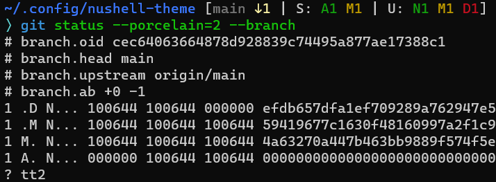

# A prompt theme for Nushell
一个 Nushell 的命令行提示主题。



## 使用说明
1. 将 `prompt.nu` 文件下载到 `~/.config/nushell` 目录。
2. 运行 `config nu` 并在配置文件中添加如下内容。
```nu
source ~/.config/nushell/prompt.nu
let-env PROMPT_INDICATOR = { "" }
let-env PROMPT_COMMAND = { full-left-prompt }
```
3. 保存后重新运行 nushell

## 高级用法
对上面的内容进行修改。

1. 顺序执行自定义项
```nu
let-env PROMPT_COMMAND = { left-prompt [
    'user',
    'dir',
    'fast-git'
    'duration',
]}
```
2. 并列执行自定义项。目前耗时没有什么差异。
```nu
let-env PROMPT_COMMAND = { par-left-prompt [
    'user-host',
    'dir',
    'full-git'
    'duration',
]}
```

## 选项列表
```nu
[
    'user', # 始终隐藏主机名
    'user-host', # 使用 SSH 远程登陆时自动显示主机名
    'dir', # 当前目录
    'full-git' # 较完整的 Git 信息，包括 stage 状态。
    'fast-git' # 较快速的 Git 信息，比 full-git 信息要少，适用于 Windows 系统。
               # 也可以两个都不选。
    'duration', # 命令执行时间
]
```
